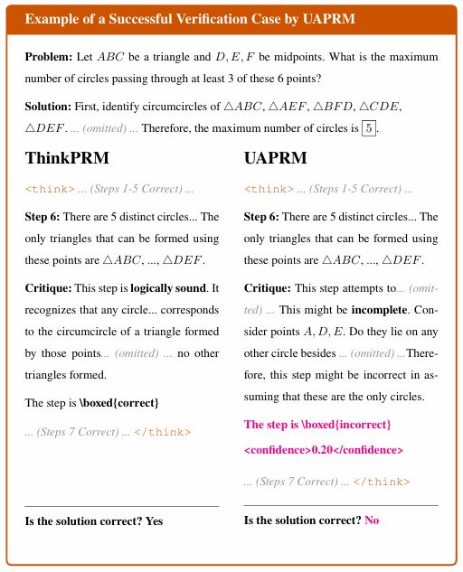
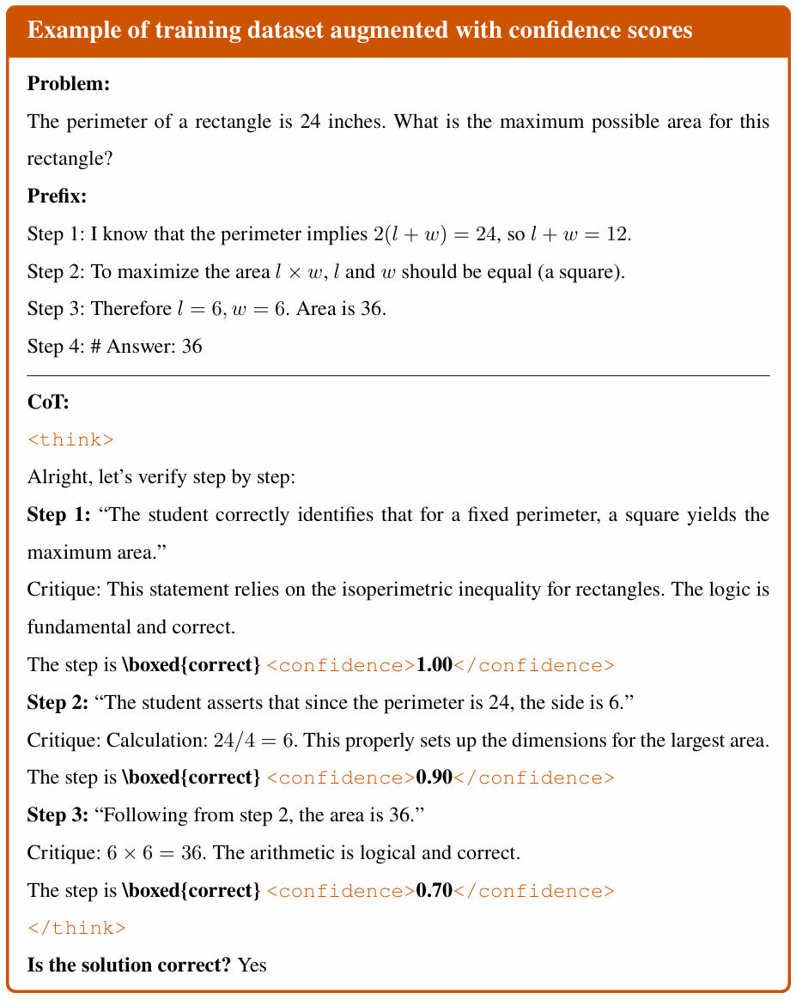

# UAPRM: Uncertainty-Aware Process Reward Models

  
  
  
  

  <h3>Mitigating Overconfidence in Generative Verifiers via Step-wise Uncertainty Quantification</h3>

---

## 📖 Introduction

**UAPRM (Uncertainty-Aware Process Reward Model)** is a novel generative verifier framework developed for my Master's Thesis. It addresses the critical **"Overconfidence"** issue in existing Generative PRMs (e.g., ThinkPRM).

While standard Generative PRMs provide interpretable reasoning chains, they often fail to accurately quantify the probability of correctness for each step. **UAPRM** improves downstream search reliability (Best-of-N, Tree Search) by explicitly modeling **step-wise confidence scores**.

> **Note:** This repository serves as an overview. The full source code and manuscript are currently private due to ongoing conference submission preparation.

---

## 📈 Performance: ThinkPRM vs. UAPRM

The core difference lies in how the verifier evaluates reasoning steps.

  
  
<em>Figure 1: Comparison of Inference Mechanisms. Unlike ThinkPRM which relies on implicit token probabilities, UAPRM generates explicit, calibrated confidence scores for each reasoning step.</em>

* **ThinkPRM (Baseline):** Generates verification text but often assigns high probabilities to incorrect steps due to lack of calibration.
* **UAPRM (Ours):** Outputs both the verification rationale and a **calibrated confidence score** (e.g., `<confidence>0.85</confidence>`), allowing for more precise reward modeling.

---

## 💡 Methodology: Training with Soft Labels

To train the model to be uncertainty-aware, we constructed a specialized dataset using **Step-wise Verification Sampling**.

  
  
<em>Figure 2: Structure of the UAPRM Training Dataset. Instead of binary labels (0/1), we utilize soft labels derived from consistency checks to teach the model nuance and uncertainty.</em>

### 1. Data Construction Pipeline
* **Sampling:** For each reasoning step, we sample $N$ verification outputs from a teacher model.
* **Soft Labeling:** The ratio of "Correct" judgments forms the ground-truth confidence score (e.g., 8/10 positive judgements $\rightarrow$ 0.8).
* **Dataset Format:** The training data contains the question, the reasoning step, and the calculated **confidence score** as the target label.

### 2. Token-wise Weighted Training
We implemented a custom **Weighted Trainer** that adjusts the loss based on the confidence level.
* **Logic:** Steps with high uncertainty (e.g., confidence 0.5) contribute differently to the gradient compared to clear-cut steps.
* **Implementation:** The `TokenWiseWeightedTrainer` applies specific weights defined in `CONFIDENCE_WEIGHTS` during Cross-Entropy calculation.

---

## 🛠️ System Architecture (Implementation Details)

Although the source code is private, the system consists of the following modules:

| Module | Description | Key Technologies |
| :--- | :--- | :--- |
| **Training Engine** | Custom trainer supporting confidence-weighted loss and QLoRA fine-tuning. | `transformers`, `peft`, `TokenWiseWeightedTrainer` |
| **Inference Engine** | High-throughput generation for multi-path reasoning and verification. | `vLLM`, `SGLang`, `thinkprm_api.py` |
| **Data Pipeline** | Automated pipeline for step-wise sampling and soft-label generation. | `asyncio`, `numpy` |
| **Evaluation** | Benchmarking suite for Best-of-N and Weighted Voting. | `ProcessBench`, `MATH-500` |